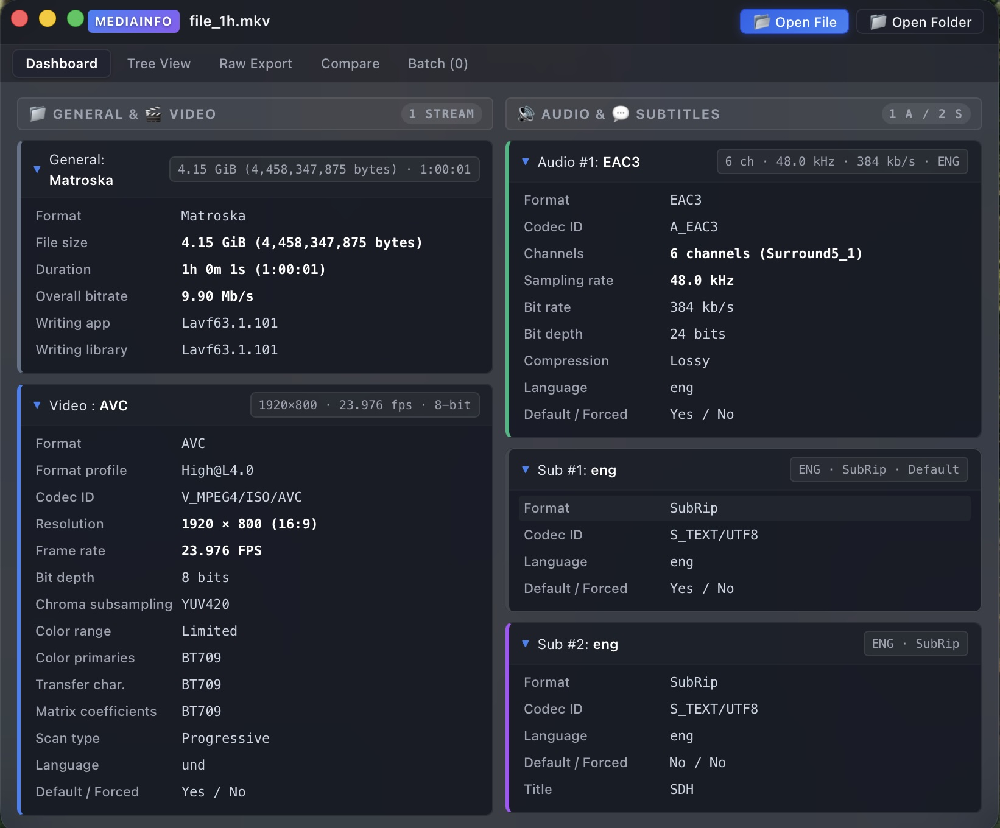

# Vuio Media Info

A high-performance, pure Rust rewrite of [MediaInfoLib](https://github.com/MediaArea/MediaInfoLib).

Provides technical and tag information about video and audio files with memory safety, zero-copy bitstream parsing, and multithreaded batch processing.

Crossplatform GUI & CLI



---

## Key Features

* **Exhaustive Container & Demuxer Support**:
  * **ISOBMFF / MP4 / QuickTime** (`.mp4`, `.mov`, `.m4v`, `.m4a`, `.m4b`, `.qt`) — full atom tree decoding (`moov`, `trak`, `mdia`, `stbl`, `stsd`, `esds`, `pasp`, `clap`, `colr`, `dvcC`, `dvvC`, `hvcC`, `avcC`, `av1C`, `vp09`, `alac`).
  * **Matroska / WebM** (`.mkv`, `.mka`, `.mks`, `.mk3d`, `.webm`) — EBML parser, track headers, attachments & cover art, chapters, cue points.
  * **RIFF** (`.avi`, `.wav`, `.wave`, `.bwf`, `.rf64`) — `LIST/movi`, `avih`, `strh`, `strf`, `fmt `, `bext`, `INFO` tags.
  * **MPEG Transport Stream** (`.ts`, `.m2ts`, `.mts`, `.m2t`) — PAT/PMT packet demuxing, PES payload parsing.
  * **MPEG Program Stream / VOB** (`.mpg`, `.mpeg`, `.vob`, `.evob`) — Pack and packet headers.
  * **Ogg** (`.ogg`, `.ogv`, `.oga`, `.ogx`, `.opus`, `.spx`) — Ogg pages, bitstream demuxing, Vorbis comments, OpusHead.
  * **MXF** (`.mxf`) — Material eXchange Format KLV BER length parsing and descriptor reading.
  * **ASF / WMV / WMA** (`.asf`, `.wmv`, `.wma`) — Advanced Systems Format header object parsing.
  * **Flash Video** (`.flv`, `.f4v`) — Video, audio, and metadata tag demuxing.
  * **Audiophile & Lossless Containers**: **CAF** (`.caf`), **DSF / DSDIFF** (`.dsf`, `.dff`), **APE** (`.ape`), **WavPack** (`.wv`, `.wvc`), **AIFF** (`.aif`, `.aiff`, `.aifc`), **TrueAudio** (`.tta`), **AMR** (`.amr`, `.awb`), **IVF** (`.ivf`), **Y4M** (`.y4m`).
* **Deep Video Bitstream Inspection**:
  * **H.264 / AVC**: Full SPS/VUI parsing (Profile, Level, SAR/PAR, chroma format, bit depth, frame rate, colorimetry, cropping).
  * **H.265 / HEVC**: Profile Tier Level (Main, Main 10, Main 12, Rext), VUI, SMPTE ST 2086 HDR10 mastering display, MaxCLL/MaxFALL.
  * **Dolby Vision**: Complete RPU (Reference Processing Unit) metadata decoding (Profiles 4, 5, 7, 8, 9, levels, BL+EL+RPU, DM version).
  * **AV1**: Sequence Header OBU parsing (Profile 0/1/2, color primaries, transfer characteristics, matrix, full/limited range, bit depth).
  * **VP9 & VP8**: Frame header & color space parsing, profile 0/1/2/3, chroma subsampling.
  * **Apple ProRes**: Frame header & container atoms (`apcn`, `apch`, `apcs`, `apco`, `ap4h`, `ap4x`), colorimetry.
  * **VVC (H.266)**: SPS parsing (Versatile Video Coding).
  * **GoPro CineForm (SMPTE ST 2073)**: Sample header decompression and resolution decoding.
  * **MPEG-1/2 Video**: Sequence header and extension parsing.
* **Deep Audio Bitstream Inspection**:
  * **AAC**: ADTS frames and ISO `AudioSpecificConfig` (AAC-LC, HE-AAC v1/v2, SBR, PS, LD/ELD, 960/1024 frame lengths).
  * **Dolby Digital / Plus**: AC-3 and E-AC-3 frame synchronization, Dialog Normalization, Joint Object Coding (Dolby Atmos spatial audio).
  * **Dolby TrueHD**: MLP / TrueHD major and minor sync frames, Dolby Atmos object streams.
  * **Dolby AC-4**: Next-gen AC-4 TOC headers, bitstream presentations, immersive audio.
  * **DTS / DTS-HD / DTS:X**: Core stream, Extension Substream (Master Audio, High Resolution), Channel Mask.
  * **FLAC**: STREAMINFO metadata block (sample rates, bit depths, MD5 checksum).
  * **Apple Lossless (ALAC)**: Apple Lossless Audio Codec `alac` atom header parsing.
  * **MPEG Audio**: MP1 / MP2 / MP3 layer detection, Xing / Info / VBRI VBR headers, LAME tags.
  * **Opus**: `OpusHead` packets, channel mapping families, pre-skip.
  * **MPEG-H 3D Audio**: MHAS / 3D spatial stream header parsing.
  * **AMR / AMR-WB**: Narrowband and Wideband frame inspection.
  * **PCM / LPCM**: Uncompressed linear PCM formats (Big/Little Endian, integer, floating point).
* **Subtitle & Text Stream Engine**:
  * **SRT (SubRip)**, **SSA / ASS (Advanced SubStation Alpha)**, **WebVTT**, **PGS (SUP)**, **VobSub (IDX/SUB)**, **DVB Subtitles**, **EIA-608 / EIA-708** Closed Captions.
* **Rich Metadata & Tag Extraction**:
  * ID3v1, ID3v2.2, ID3v2.3, ID3v2.4 (synchsafe integers, UTF-8/UTF-16 text, APIC cover art extraction).
  * Vorbis Comments (FLAC, Ogg, Opus).
  * Apple / iTunes `ilst` atoms & cover art.
  * EXIF / TIFF tags & Adobe XMP metadata.
  * APEv1 & APEv2 tags.
* **Multi-Format Export & Diff Engine**:
  * Classic aligned 2-column MediaInfo text.
  * Standard MediaInfo JSON schema (`{"media": {"track": [...]}}`).
  * MediaInfo 2.0 XML schema.
  * CSV batch export.
  * Standalone styled HTML reports.
  * Built-in differential comparison engine (`vuio_media_info::compare`).
* **Ergonomic Single-Crate Rust API & CLI**:
  * Clean, stabilized library API published as a single crate (`vuio-media-info`).
  * Fast CLI tool with recursive directory scanning, filter queries, and color output.

---

## CLI Usage
 
 ### Basic Inspection (Classic Text)
 ```bash
 vuio-media-info movie.mkv
 ```
 
 ### JSON Output
 ```bash
 vuio-media-info -O json movie.mp4
 ```
 
 ### XML Output
 ```bash
 vuio-media-info -O xml sample.m2ts
 ```
 
 ### CSV Batch Summary
 ```bash
 vuio-media-info -O csv -r /path/to/media/library/ > library_report.csv
 ```
 
 ### Standalone HTML Report
 ```bash
 vuio-media-info -O html video.mkv > report.html
 ```
 
 ---
 
 ## License
 
 MIT or Apache 2.0
 
 ---
 
 ## Attribution
 
 Part of this work is based on MediaInfoLib
 See NOTICE